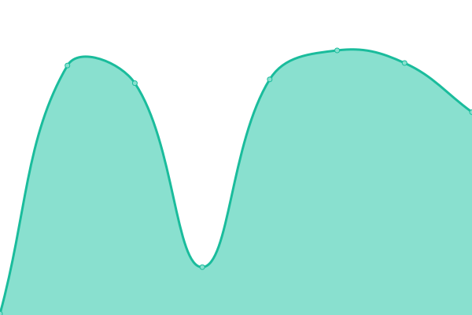
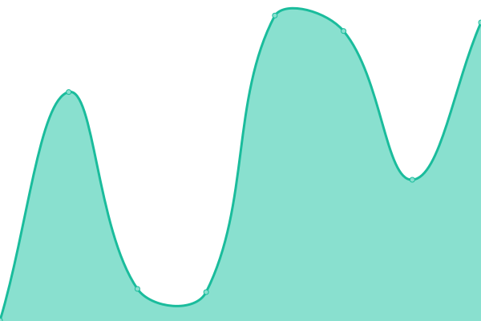
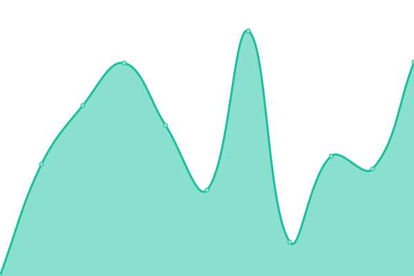
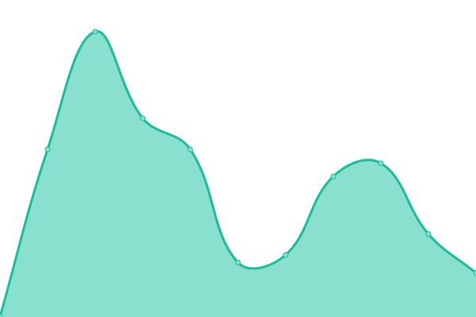

# [📈 Live Status](https://gitetsu.github.io/whoogle-instances-upptime): <!--live status--> **🟧 Partial outage**

This repository contains the open-source uptime monitor and status page for [gitetsu](https://gitetsu.github.io/whoogle-instances-upptime), powered by [Upptime](https://github.com/upptime/upptime).

With [Upptime](https://upptime.js.org), you can get your own unlimited and free uptime monitor and status page, powered entirely by a GitHub repository. We use [Issues](https://github.com/gitetsu/whoogle-instances-upptime/issues) as incident reports, [Actions](https://github.com/gitetsu/whoogle-instances-upptime/actions) as uptime monitors, and [Pages](https://gitetsu.github.io/whoogle-instances-upptime) for the status page.

<!--start: status pages-->
<!-- This summary is generated by Upptime (https://github.com/upptime/upptime) -->
<!-- Do not edit this manually, your changes will be overwritten -->
<!-- prettier-ignore -->
| URL | Status | History | Response Time | Uptime |
| --- | ------ | ------- | ------------- | ------ |
|  [search.albony.xyz](https://search.albony.xyz) | 🟥 Down | [search-albony-xyz.yml](https://github.com/gitetsu/whoogle-instances-upptime/commits/HEAD/history/search-albony-xyz.yml) | 

 0ms
     
 | 

<a href="https://gitetsu.github.io/whoogle-instances-upptime/history/search-albony-xyz">0.00%</a>
    

|  [search.garudalinux.org](https://search.garudalinux.org) | 🟩 Up | [search-garudalinux-org.yml](https://github.com/gitetsu/whoogle-instances-upptime/commits/HEAD/history/search-garudalinux-org.yml) | 

 4929ms
     
 | 

<a href="https://gitetsu.github.io/whoogle-instances-upptime/history/search-garudalinux-org">93.25%</a>
    

|  [search.dr460nf1r3.org](https://search.dr460nf1r3.org) | 🟥 Down | [search-dr460nf1r3-org.yml](https://github.com/gitetsu/whoogle-instances-upptime/commits/HEAD/history/search-dr460nf1r3-org.yml) | 

 0ms
     
 | 

<a href="https://gitetsu.github.io/whoogle-instances-upptime/history/search-dr460nf1r3-org">0.00%</a>
    

|  [s.tokhmi.xyz](https://s.tokhmi.xyz) | 🟩 Up | [s-tokhmi-xyz.yml](https://github.com/gitetsu/whoogle-instances-upptime/commits/HEAD/history/s-tokhmi-xyz.yml) | 

 440ms
     
 | 

<a href="https://gitetsu.github.io/whoogle-instances-upptime/history/s-tokhmi-xyz">100.00%</a>
    

|  [search.sethforprivacy.com](https://search.sethforprivacy.com) | 🟩 Up | [search-sethforprivacy-com.yml](https://github.com/gitetsu/whoogle-instances-upptime/commits/HEAD/history/search-sethforprivacy-com.yml) | 

 265ms
     
 | 

<a href="https://gitetsu.github.io/whoogle-instances-upptime/history/search-sethforprivacy-com">96.37%</a>
    

|  [whoogle.dcs0.hu](https://whoogle.dcs0.hu) | 🟩 Up | [whoogle-dcs0-hu.yml](https://github.com/gitetsu/whoogle-instances-upptime/commits/HEAD/history/whoogle-dcs0-hu.yml) | 

 6207ms
     
 | 

<a href="https://gitetsu.github.io/whoogle-instances-upptime/history/whoogle-dcs0-hu">99.83%</a>
    

|  [whoogle.esmailelbob.xyz](https://whoogle.esmailelbob.xyz) | 🟥 Down | [whoogle-esmailelbob-xyz.yml](https://github.com/gitetsu/whoogle-instances-upptime/commits/HEAD/history/whoogle-esmailelbob-xyz.yml) | 

 0ms
     
 | 

<a href="https://gitetsu.github.io/whoogle-instances-upptime/history/whoogle-esmailelbob-xyz">0.00%</a>
    

|  [gowogle.voring.me](https://gowogle.voring.me) | 🟥 Down | [gowogle-voring-me.yml](https://github.com/gitetsu/whoogle-instances-upptime/commits/HEAD/history/gowogle-voring-me.yml) | 

 0ms
     
 | 

<a href="https://gitetsu.github.io/whoogle-instances-upptime/history/gowogle-voring-me">0.00%</a>
    

|  [whoogle.privacydev.net](https://whoogle.privacydev.net) | 🟩 Up | [whoogle-privacydev-net.yml](https://github.com/gitetsu/whoogle-instances-upptime/commits/HEAD/history/whoogle-privacydev-net.yml) | 

 1463ms
     
 | 

<a href="https://gitetsu.github.io/whoogle-instances-upptime/history/whoogle-privacydev-net">99.24%</a>
    

|  [wwg.vern.cc](https://wg.vern.cc) | 🟥 Down | [wwg-vern-cc.yml](https://github.com/gitetsu/whoogle-instances-upptime/commits/HEAD/history/wwg-vern-cc.yml) | 

 0ms
     
 | 

<a href="https://gitetsu.github.io/whoogle-instances-upptime/history/wwg-vern-cc">0.00%</a>
    

|  [www.indexia.gq](https://www.indexia.gq) | 🟥 Down | [www-indexia-gq.yml](https://github.com/gitetsu/whoogle-instances-upptime/commits/HEAD/history/www-indexia-gq.yml) | 

 0ms
     
 | 

<a href="https://gitetsu.github.io/whoogle-instances-upptime/history/www-indexia-gq">0.00%</a>
    

|  [whoogle.hostux.net](https://whoogle.hostux.net) | 🟩 Up | [whoogle-hostux-net.yml](https://github.com/gitetsu/whoogle-instances-upptime/commits/HEAD/history/whoogle-hostux-net.yml) | 

 670ms
     
 | 

<a href="https://gitetsu.github.io/whoogle-instances-upptime/history/whoogle-hostux-net">100.00%</a>
    

|  [whoogle.lunar.icu](https://whoogle.lunar.icu) | 🟥 Down | [whoogle-lunar-icu.yml](https://github.com/gitetsu/whoogle-instances-upptime/commits/HEAD/history/whoogle-lunar-icu.yml) | 

 791ms
     
 | 

<a href="https://gitetsu.github.io/whoogle-instances-upptime/history/whoogle-lunar-icu">99.00%</a>
    

<!--end: status pages-->

[**Visit our status website →**](https://gitetsu.github.io/whoogle-instances-upptime)

## 📄 License

- Powered by: [Upptime](https://github.com/upptime/upptime)
- Code: [MIT](./LICENSE) © [gitetsu](https://gitetsu.github.io/whoogle-instances-upptime)
- Data in the `./history` directory: [Open Database License](https://opendatacommons.org/licenses/odbl/1-0/)
